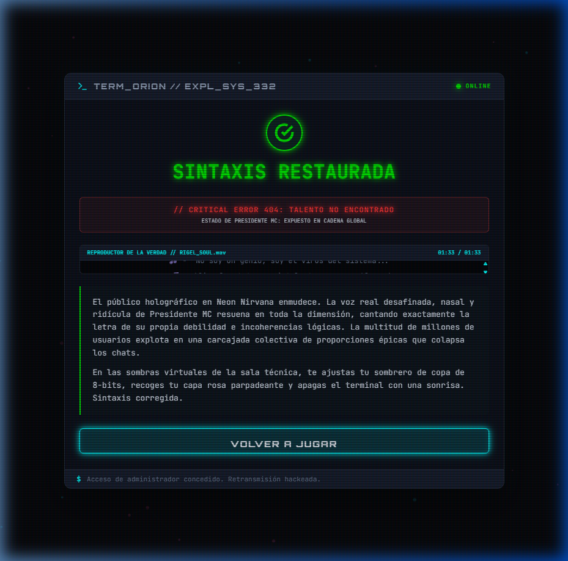

# TERM_ORION // NEON_NIRVANA EXPLOIT 🎮👾
## Módulo de Infiltración y Sabotaje — Universo Proiectio

Este es un minijuego web interactivo de estética retro-futurista cyberpunk que recrea fielmente los acontecimientos del **Capítulo 6: El Remix de la Justicia** del libro **CLOTO (Libro 1 de la trilogía Proiectio)**.

> [!NOTE]
> En este operativo web, el usuario asume el rol del hacker **Orion**, quien con la ayuda de la inteligencia artificial **Mite**, debe infiltrarse en los servidores VIP de **Neon Nirvana** y sabotear el concierto en vivo de **Presidente MC** para humillar su falso ego y hacer sonar el remix de la verdad, restituyendo la dignidad lógica de su hermano **Rigel**.

---

## 📸 Demostración del Exploit (Pantalla de Victoria)

A continuación se muestra una captura en alta resolución de la retransmisión vulnerada con éxito, mostrando el reproductor de karaoke holográfico cantando el remix de la justicia:



---

## 🛠️ Arquitectura de Archivos y Componentes

La aplicación se ha desarrollado utilizando **HTML5, CSS3 y JavaScript Puro (Vanilla)** para garantizar la portabilidad absoluta, una tasa de refresco fluida de **60 FPS** en animaciones dinámicas, y una ejecución inmediata sin necesidad de dependencias o compiladores.

1. **[index.html](index.html)**: Estructura semántica del terminal táctil. Utiliza fuentes tipográficas premium (*Orbitron* y *JetBrains Mono*) e integra iconos vectoriales de control de forma nativa.
2. **[style.css](style.css)**: Hoja de estilos con variables de color HSL neón, efectos de desenfoque de cristal translúcido (*Glassmorphic*), simulación de pantalla CRT retro (scanlines analógicas y parpadeo estático) y animaciones de glitch digital en texto.
3. **[app.js](app.js)**: Motor interactivo principal del juego.
   * **Web Audio API**: Sintetiza en tiempo real pitidos de 8 bits, explosiones sonoras de DDoS y alarmas de alerta utilizando osciladores nativos, eliminando la necesidad de descargar pesados archivos de audio `.mp3`.
   * **Lienzos de Canvas**: Renderiza ondas de frecuencia senoidales interactivas para el Firewall de voz y chispas de partículas expansivas al sobrecargar el Firewall de copyright.

---

## 🎮 Fases del Operativo de Infiltración

El juego consta de una serie de desafíos correlativos bajo presión temporal (120 segundos para completar las 3 capas):

### 1. Conexión de Enlace (Intro)
Breve contextualización narrativa del asalto técnico y enlace inicial a la dimensión virtual.

### 2. Sastrería Digital (Charla con Mite)
La IA Mite detecta tu armadura básica de "Novato Gris". Para evadir los escáneres estéticos del VIP, te equipa con el **Sombrero de 8-Bits** y la **Capa Rosa de Neón** emitiendo la señal *"PARTY"*, camuflándote como un influencer excéntrico de vanguardia.

### 3. Diagnóstico de Barreras (Infiltración)
Despliegue del panel del núcleo con los 3 Firewalls activos y bloqueo de accesos.

### 4. Firewall 1: Autotune Espectral
Presidente MC carece de afinación real y se refugia en filtros lógicos. El usuario debe deslizar el control de **"Arrogancia (Ego Core)"** por encima del **95%**.
* *Detalle técnico*: El osciloscopio en Canvas reacciona en tiempo real. Al superar el 95%, el flujo senoidal entra en resonancia crítica, alterando colores a neón magenta y desatando glitches estáticos que simulan el colapso del filtro vocal corporativo.

### 5. Firewall 2: Inundación DDoS de Copyright
La infraestructura de patentes monopólicas de Humania Records bloquea las rimas. El usuario debe sobrecargar el núcleo haciendo **clic repetido (15 impactos)**.
* *Detalle técnico*: Un canvas interactivo genera ondas concéntricas cian/rosa y ráfagas de chispas en la zona de clic, mientras se liberan textos flotantes aleatorios de patentes rompiéndose (ej. *"BREATHING_LICENSE_v1.2 // REVOCADA"*).

### 6. Firewall 3: Sincronización de Inyección (Payload)
El cortafuegos final valida la firma de los paquetes entrantes. El usuario debe presionar **"INYECTAR CÓDIGO"** exactamente cuando la aguja osciladora en movimiento esté alineada dentro de la **zona verde central (40% - 60%)**.
* *Detalle técnico*: Un fallo en el disparo restará 5 segundos de contraataque en el temporizador y sacudirá el terminal simulando un glitch de alerta. Un acierto inyectará el script `Mis_Excusas_Remix.mp3`.

### 7. Victoria: Sintaxis Restaurada
El holograma gigante de Presidente MC retransmite su voz real (Chillona, desafinada y cómica) cantando la lírica de su propia mentira. Se inicia un reproductor de karaoke táctico donde las letras avanzan y se iluminan dinámicamente al ritmo de notas sintetizadas.

---

## 🚀 Instrucciones para Ejecución Local

Para probar el videojuego en tu navegador local, tienes dos alternativas rápidas:

### Alternativa A: Ejecución directa en navegador
Puedes abrir el archivo `index.html` arrastrándolo a la barra de direcciones de cualquier navegador moderno.

### Alternativa B: Servidor local en segundo plano (Recomendado)
Para evitar bloqueos de seguridad del navegador relativos al acceso a archivos del sistema local (`C:/...`), puedes inicializar un servidor ligero. 

1. Abre una consola de PowerShell en la carpeta del juego:
   ```powershell
   cd "C:\Users\Snow\.gemini\antigravity\scratch\PROIECTIO\Web\remix_justicia"
   ```
2. Ejecuta un servidor HTTP básico de Python:
   ```powershell
   python -m http.server 8000
   ```
3. Abre tu navegador e ingresa a:
   [http://localhost:8000/index.html](http://localhost:8000/index.html)

---

## 🔒 Conexiones del Lore (Semillas Transmedia)
* **Semilla Transmedia**: *"La verdad es el único remix que no pueden borrar"*
* **Código de Mite descifrado**: `ERROR_CORRECTED_332`
* **Definición de Pandora**: *"Rigel: Señal pura"*
